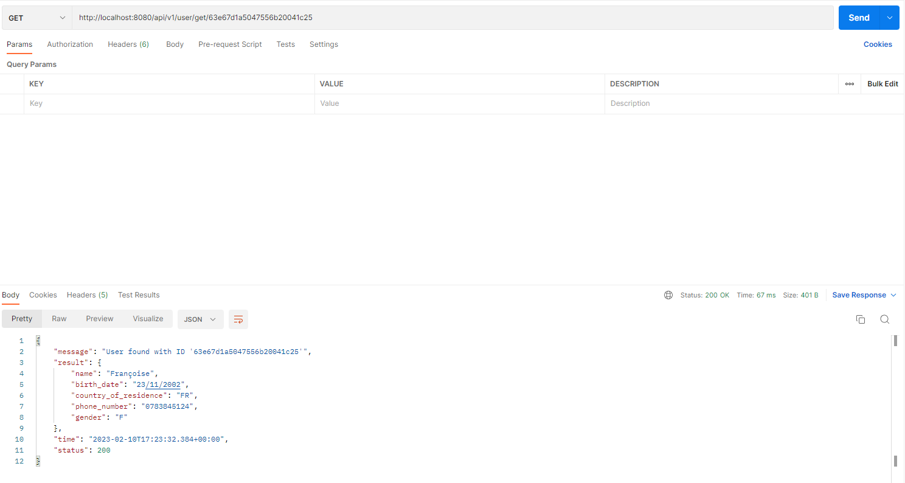
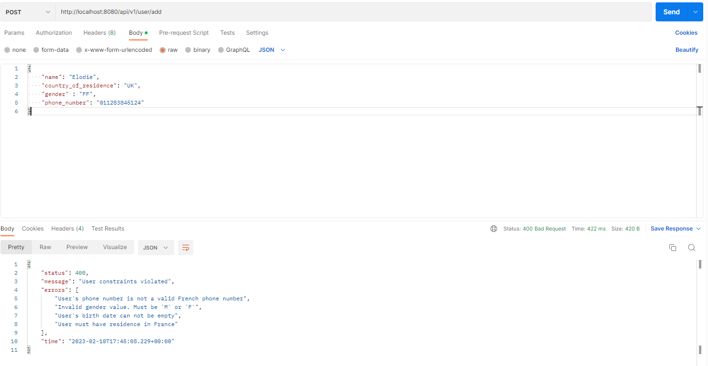

# Welcome to the UserAPI demo application

## 1. Installation

The application is based on SpringBoot framework, shipped with an embedded MongoDB database

To install dependencies for this demo application, run the following command : 

```
./mvnw clean install
```
If you want to skip tests, then run :

```
./mvnw clean install -Dmaven.test.skip
```

Both commands will generate a deployable file (.jar) on the target folder. 
To run the application, execute the following command :  

```
./mvnw spring-boot:run
```

The application runs at : 

```
http://localhost:8080/api/v1/
```

and an OpenAPI to document and test the entry points will be available at : 
```
http://localhost:8080/api/v1/swagger-ui/index.html
```

## 2. PostMan Screenshot tests

### 2.1. Adding an user :


### 2.2. Finding all users :


### 2.3. Finding one user :



### 2.4. User not found :


### 2.5. Constraints violated :




